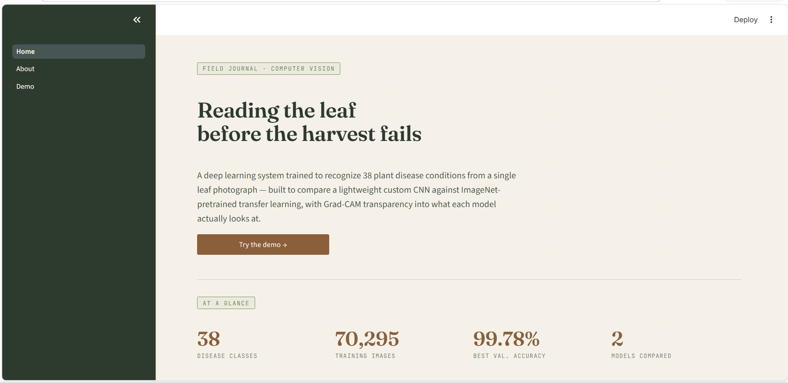

# 🌿 Plant Disease Classification

Automatic plant disease identification from leaf images using deep learning, with Grad-CAM visual explanations. Trained on the **New Plant Diseases Dataset** (38 classes, 70,295 images), comparing a custom CNN against MobileNetV2 transfer learning — and surfacing a key limitation that accuracy alone doesn't reveal.

**🔗 Live demo:** [your-app-name.streamlit.app](https://your-app-name.streamlit.app) <!-- update after deploying -->

 <!-- add a screenshot of the Demo page -->

---

## Results

| Model        | Parameters | Best Epoch | Val Accuracy | Val Loss | F1 (Macro) |
| ------------ | ---------: | ---------: | -----------: | -------: | ---------: |
| Baseline CNN |    466,918 |         19 |       99.78% |   0.0075 |     99.78% |
| MobileNetV2  |  2,596,710 |         23 |       99.60% |   0.0155 |     99.58% |

> On paper, the custom Baseline CNN edges out MobileNetV2 while using **5.6× fewer parameters**. But that's not the full story — see **Key Finding** below.

---

## Key Finding: Accuracy Isn't the Whole Story

Grad-CAM visualizations across the test set reveal a meaningful gap between the two models' _reasoning_, not just their accuracy:

- **Baseline CNN** frequently attends to **background and leaf-edge artifacts** rather than disease lesions when classifying real-world test images.
- **MobileNetV2** — leveraging ImageNet-pretrained features — more consistently attends to the **actual symptomatic regions** on the leaf.

This suggests the Baseline CNN's higher validation accuracy is partly inflated by shortcut learning: the validation set shares the same controlled imaging pipeline as training, so background/texture cues that don't reflect real disease patterns still "work" on paper. MobileNetV2's pretrained features likely generalize better to leaf photos taken outside this dataset's conditions, despite a marginally lower benchmark score.

|                     | Baseline CNN                  | MobileNetV2             |
| ------------------- | ----------------------------- | ----------------------- |
| Validation Accuracy | 99.78% (higher)               | 99.60%                  |
| Grad-CAM focus      | Often background / leaf edges | Consistently on lesions |

See the **About** page in the live demo for the full discussion, or `figures/gradcam_comparison/` for the raw visualizations across all 33 test images.

---

## Dataset

**New Plant Diseases Dataset (Augmented)** — [Kaggle](https://www.kaggle.com/datasets/vipoooool/new-plant-diseases-dataset)

| Metric                | Value            |
| --------------------- | ---------------- |
| Classes               | 38               |
| Total Training Images | 70,295           |
| Validation Images     | 17,572           |
| Largest Class         | 2,022 images     |
| Smallest Class        | 1,642 images     |
| Image Resolution      | 256 × 256 × 3    |
| Class Imbalance Ratio | ~1.23 (balanced) |

Classes cover 14 plant species — Apple, Corn, Grape, Tomato, Potato, and more — each with healthy and diseased variants.

> **Note on the test set:** the dataset's official `test/` folder contains only 33 images with labels encoded in filenames rather than folder structure, making systematic evaluation infeasible. These 33 images are kept in `data/test_images/` for qualitative Grad-CAM comparison instead. All reported metrics use the validation set (17,572 images).

---

## Project Structure

```
plant-disease-classification/
│
├── app/                          # Streamlit demo (multi-page)
│   ├── Home.py                   # Landing page
│   ├── styles.py                 # Shared CSS / design system
│   ├── predictor.py              # Model loading + inference (auto-downloads weights)
│   ├── class_names.py
│   ├── .streamlit/
│   │   └── config.toml
│   └── pages/
│       ├── 1_About.py            # Dataset, methodology, Grad-CAM discussion
│       └── 2_Demo.py             # Upload + predict + Grad-CAM
│
├── notebooks/
│   ├── plant_disease.ipynb       # Full training pipeline (run on Kaggle, T4 GPU)
│   └── Report.ipynb
│
├── src/
│   ├── compare_models.py         # Phase 6: model comparison charts
│   ├── inference.py              # CLI inference on a single image
│   ├── gradcam.py                # Grad-CAM implementation (both architectures)
│   ├── gradcam_batch_compare.py  # Batch Grad-CAM across test_images/
│
├── reports/
│   ├── baseline_metrics.json
│   ├── mobilenet_metrics.json
│   └── comparison_summary.json
│
├── figures/
│   ├── baseline_accuracy.png
│   ├── baseline_loss.png
│   ├── baseline_confusion_matrix.png
│   ├── mobilenet_accuracy.png
│   ├── mobilenet_loss.png
│   ├── mobilenet_confusion_matrix.png
│   ├── comparison_accuracy_f1.png
│   ├── comparison_params.png
│   ├── comparison_val_loss.png
│   └── gradcam_comparison/       # Per-image + full-grid Grad-CAM comparisons
│
├── data/
│   └── test_images/              # 33 labeled test images (kept — used for Grad-CAM demo)
│
├── models/                       # NOT in repo — see "Model Weights" below
├── requirements.txt
├── README.md
└── .gitignore
```

---

## Model Weights

Trained models (`baseline_cnn.keras`, `mobilenetv2.keras`) are **not committed to this repository** due to file size. They are hosted as [GitHub Releases](../../releases) instead.

- The Streamlit app **automatically downloads** the required model on first run (cached for the session) — no manual setup needed for the live demo.
- To run inference scripts locally, download the weights manually:

```bash
mkdir -p models
curl -L -o models/baseline_cnn.keras https://github.com/<user>/<repo>/releases/download/v1.0/baseline_cnn.keras
curl -L -o models/mobilenetv2.keras  https://github.com/<user>/<repo>/releases/download/v1.0/mobilenetv2.keras
```

---

## Methodology

### Phase 1–2: Data Pipeline

Images loaded via `image_dataset_from_directory`, one-hot encoded across 38 classes, batched at size 32, with `AUTOTUNE` prefetching. Augmentation kept intentionally light — random horizontal flip and ±3% rotation — since the dataset is already pre-augmented and aggressive transforms risk distorting the lesion patterns that define each disease.

### Phase 3: Baseline CNN

A lightweight custom CNN trained from scratch:

```
Input (256×256×3)
→ Rescaling (1/255)
→ Conv Block ×4 (Conv2D + BatchNorm + ReLU + MaxPool)
→ Global Average Pooling
→ Dense(256) + BatchNorm + ReLU + Dropout(0.3)
→ Softmax(38)
```

- **Optimizer:** Adam (lr=1e-3) · **Loss:** Categorical Crossentropy
- **Callbacks:** ModelCheckpoint, EarlyStopping (patience=5), ReduceLROnPlateau

### Phase 4: MobileNetV2 Transfer Learning

Two-phase training strategy:

**Phase 1 — Head training**
Base model frozen (155 layers) · train classification head only · lr=1e-3, patience=3

**Phase 2 — Fine-tuning**
Top 40 layers unfrozen · lr=1e-4 to preserve pretrained features · patience=5, ReduceLROnPlateau

### Phase 6: Model Comparison

Metrics from both models aggregated into comparison charts (`src/compare_models.py`) — accuracy/F1, parameter count, and validation loss side by side.

### Grad-CAM Analysis

Gradient-weighted Class Activation Mapping applied to both architectures (`src/gradcam.py`) to visualize which image regions drive each prediction:

| Model        | Last Conv Layer                                 |
| ------------ | ----------------------------------------------- |
| Baseline CNN | `conv2d_3`                                      |
| MobileNetV2  | `out_relu` (inside nested MobileNetV2 backbone) |

Run across all 33 test images via `src/gradcam_batch_compare.py`, producing per-image 3-panel comparisons and a full grid — this is what surfaced the background-attention issue described in **Key Finding**.

---

## Installation

```bash
git clone https://github.com/<user>/<repo>.git
cd <repo>
pip install -r requirements.txt
```

---

## Usage

### Run the demo locally

```bash
streamlit run app/Home.py
```

### Run model comparison

```bash
python src/compare_models.py
```

Generates comparison charts and summary JSON in `figures/` and `reports/`.

### Run inference (CLI)

```bash
# Predict with Baseline CNN
python src/inference.py --image path/to/leaf.jpg --model baseline

# Predict with MobileNetV2 + save result image
python src/inference.py --image path/to/leaf.jpg --model mobilenet --save

# Show top-5 predictions
python src/inference.py --image path/to/leaf.jpg --model baseline --top_k 5
```

**Example output:**

```
=======================================================
  PREDICTION  (baseline)
=======================================================
  #1  Tomato___Early_blight
       ████████████████████████████████████████ 96.23%

  #2  Tomato___Late_blight
       ██ 2.11%

  #3  Tomato___Target_Spot
       █ 1.66%
=======================================================
```

### Run batch Grad-CAM comparison

```bash
python src/gradcam_batch_compare.py
```

Outputs per-image comparisons and a full grid to `figures/gradcam_comparison/`.

---

## Key Findings Summary

- A **custom CNN with only 466K parameters** achieved 99.78% validation accuracy on a 38-class classification task — outperforming a 2.6M-parameter pretrained model on standard metrics.
- **Grad-CAM reveals this ranking is misleading**: the Baseline CNN partly relies on background and leaf-edge cues, while MobileNetV2 attends more reliably to actual disease lesions — likely generalizing better outside this dataset's controlled conditions.
- Minor misclassifications cluster in **visually similar disease pairs**, particularly within Corn and Tomato categories (e.g., Cercospora leaf spot vs. Northern Leaf Blight).
- The validation set shares the same augmentation pipeline as training, which likely contributes to the high reported accuracy for both models. The official test set (33 images) was used qualitatively for Grad-CAM comparison rather than quantitative evaluation, due to its filename-based labeling.

---

## Requirements

```
tensorflow>=2.13
numpy
pandas
matplotlib
seaborn
scikit-learn
opencv-python
streamlit
Pillow
```

---

## License

This project is for educational and portfolio purposes. The dataset is sourced from Kaggle under its original license.
